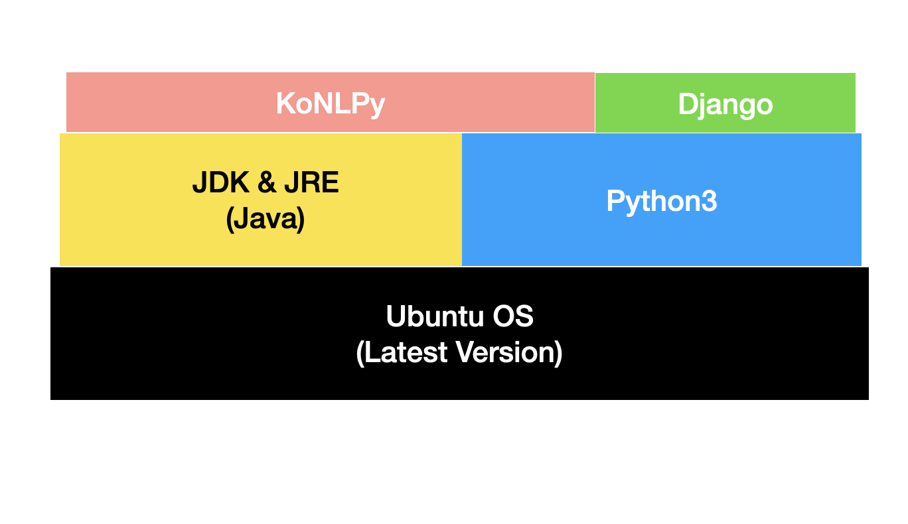

# Django & Konlpy for Docker Deployment to AWS

## Structure

OS is Ubuntu latest verision

* JRE/JDK on top of Ubuntu
  * KoNLPy's dependency
* Python3 and pip3 on top of Ubuntu
  * Django and its dependencies
  * KoNLPy
  * psycopg2-binary for PostgreSQL DB connection

